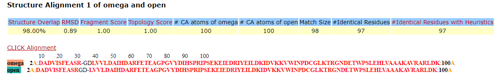
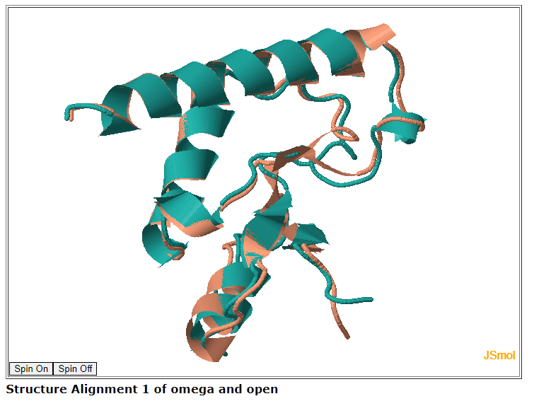

# Assignement 6

Sequence:

`MDADVISFEASRGDLVVLDAIHDARFETEAGPGVYDIHSPRIPSEKEIEDRIYEILDKIDVKKVWINPDCGLKTRGNDETWPSLEHLVAAAKAVRARLDK`

Prediction tools: [OpenFold](https://colab.research.google.com/github/sokrypton/ColabFold/blob/main/AlphaFold2.ipynb),  [OmegaFold](https://colab.research.google.com/github/sokrypton/ColabFold/blob/main/beta/omegafold.ipynb)

Pairwise alignement tool: [CLICK](https://mspc.bii.a-star.edu.sg/minhn/pairwise.html)

Predictions:
 - `open.pdb` -- OpenFold
 - `omega.pdb` -- OmegaFold

Click results (texts can be found in repo):

Visualization using JSmol:

-----

Вывод: предсказания близки, но имеют заметно отличающиеся части
